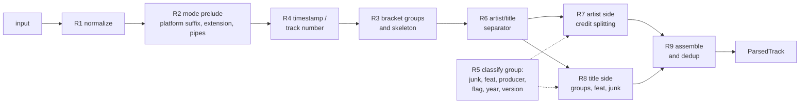

# trackparse

Parse music track names into structured metadata: artists, featured artists, remixers, version
(remix, extended, live, remaster), producers and a clean title. One spec, ports for JS/TS, Python,
Rust and more.

[](https://www.npmjs.com/package/trackparse)
[](https://github.com/4matic/trackparse/actions/workflows/js.yml)
[](https://github.com/4matic/trackparse/actions/workflows/spec.yml)
[](LICENSE)

```js
import { parse } from "trackparse";

parse("01. Wilkinson ft. Becky Hill & Tom Cane - Afterglow (Sub Focus VIP Remix) [Official Video]");
```

```json
{
  "input": "01. Wilkinson ft. Becky Hill & Tom Cane - Afterglow (Sub Focus VIP Remix) [Official Video]",
  "mode": "youtube",
  "position": { "raw": "01", "number": 1 },
  "timestamp": null,
  "artists": [
    { "name": "Wilkinson",  "role": "primary",  "joiner": null,  "source": "artist" },
    { "name": "Becky Hill", "role": "featured", "joiner": "ft.", "source": "artist" },
    { "name": "Tom Cane",   "role": "featured", "joiner": "&",   "source": "artist" }
  ],
  "title": "Afterglow",
  "fullTitle": "Afterglow (Sub Focus VIP Remix)",
  "versions": [
    {
      "type": "remix",
      "raw": "Sub Focus VIP Remix",
      "artists": [{ "name": "Sub Focus", "role": "remixer", "joiner": null, "source": "version" }],
      "modifiers": ["vip"],
      "descriptor": null,
      "year": null,
      "unknownArtist": false,
      "delimiter": "("
    }
  ],
  "year": null,
  "flags": { "explicit": false, "clean": false, "unknownArtist": false, "unknownTitle": false },
  "junk": [{ "raw": "Official Video", "kind": "video" }],
  "warnings": []
}
```

Every key is always present. Nothing in the input is silently thrown away: the track number went to
`position`, "Official Video" went to `junk`, the remix went to `versions` with its remixer as a
separate credit, and the clean title is left over.

## Contents

- [Why](#why)
- [Features](#features)
- [Install](#install)
- [Quick start](#quick-start)
- [Output reference](#output-reference)
- [Options](#options)
- [format()](#format)
- [What it understands](#what-it-understands)
- [Modes](#modes)
- [How it works](#how-it-works)
- [Spec and fixtures](#spec-and-fixtures)
- [Ports](#ports)
- [Comparison](#comparison)
- [Limitations and roadmap](#limitations-and-roadmap)
- [Contributing](#contributing)
- [License](#license)

## Why

Track strings show up everywhere: YouTube titles, scrobbles, file names, DJ tracklists, store
metadata. Most existing parsers answer one question, "what is the artist and what is the title?",
and they answer it by deleting whatever looks like noise. `Artist feat. X - Song (Y Remix)` becomes
`["Artist feat. X", "Song (Y Remix)"]`, or `["Artist", "Song"]` with the feat and the remix gone.
You can't tell that X is a featured artist, that Y is a remixer, or that this is a remix at all.

trackparse follows one rule: **extract, don't delete.** Everything it recognises lands in a field:
artists with roles, versions with a type and their own credits, junk with a kind, flags, year,
track position, timestamp. Anything it does not recognise stays in the title verbatim, so a reader
of the output can always account for every word of the input. When a heuristic fires, the output
says so in `warnings`.

The behaviour is defined by a language-neutral [spec](spec/SPEC.md) and pinned by a shared corpus of
15,000+ fixtures. The JavaScript package is the reference implementation; the Python and Rust ports
will run the same fixtures.

## Features

- **Artists as a list** with roles (`primary`, `featured`, `producer`), the joiner as written
  (`&`, `,`, `x`, `vs.`, `feat.`) and where each credit was found (`artist`, `title`, `version`).
- **Featured artists** in any position: `A ft. B - T`, `A - T (feat. B)`, `A - T feat. B`,
  `(with B)`.
- **Producers:** `(prod. by X)`, `prod. X`, `produced by X`.
- **Versions** classified into 27 types (remix, VIP, bootleg, extended, radio, original, live,
  remaster, acoustic, sped up...) with remixers, modifiers, descriptor and year. Several versions per
  track, in brackets or as dash suffixes (`- Remastered 2015`).
- **Junk** (Official Video, HD, Free Download, NCS Release, "- YouTube"...) returned with a kind,
  not just stripped.
- **Prefixes:** track numbers (`01.`, `1)`, `01 -`) and cue timestamps (`[12:34]`, `1:02:03`),
  without eating `2 Unlimited`, `311` or `50 Cent`.
- **Three input modes** with auto-detection: clean metadata, YouTube titles (pipes, `"Title" by
  Artist`, quoted titles, unspaced dashes, uploader fallback) and file names.
- **Unicode-aware:** NFC, invisible characters (zero-width space, BOM, soft hyphen), fullwidth brackets, smart quotes and dash variants
  are normalized; Cyrillic, CJK and diacritics work as-is.
- **Unknown IDs:** `ID - ID (ID Remix)` is flagged, not treated as an artist called "ID".
- **`format()`** renders a parsed track back to a string, with canonical joiners or feat moved into
  the title.
- **Total:** never throws, for any string. Zero dependencies, ESM + CJS, TypeScript types included.

## Install

```sh
npm install trackparse
pnpm add trackparse
yarn add trackparse
bun add trackparse
```

Requires Node 18+ (or any modern runtime with ES2020 and `String.prototype.normalize`).

Python (`pip install trackparse`) and Rust (`cargo add trackparse`) ports are coming soon; see
[Ports](#ports).

## Quick start

### parse

```js
import { parse } from "trackparse";

const track = parse(
  "01. Wilkinson ft. Becky Hill & Tom Cane - Afterglow (Sub Focus VIP Remix) [Official Video]",
);

track.artists.map((a) => `${a.name} (${a.role})`);
// [ 'Wilkinson (primary)', 'Becky Hill (featured)', 'Tom Cane (featured)' ]
track.title;                       // 'Afterglow'
track.fullTitle;                   // 'Afterglow (Sub Focus VIP Remix)'
track.versions[0].type;            // 'remix'
track.versions[0].artists[0].name; // 'Sub Focus'
track.versions[0].modifiers;       // [ 'vip' ]
track.junk;                        // [ { raw: 'Official Video', kind: 'video' } ]
track.position;                    // { raw: '01', number: 1 }
```

CommonJS works too: `const { parse } = require("trackparse")`.

### parseArtists

Split a bare artist string (no title) into credits.

```js
import { parseArtists } from "trackparse";

parseArtists("Sub Focus, Wilkinson & Dimension feat. Kojo");
// [
//   { name: 'Sub Focus', role: 'primary', joiner: null, source: 'artist' },
//   { name: 'Wilkinson', role: 'primary', joiner: ',', source: 'artist' },
//   { name: 'Dimension', role: 'primary', joiner: '&', source: 'artist' },
//   { name: 'Kojo', role: 'featured', joiner: 'feat.', source: 'artist' }
// ]
```

### format

```js
import { format, parse } from "trackparse";

const t = parse("Wilkinson ft. Becky Hill - Afterglow (Sub Focus Remix)");

format(t);                                          // 'Wilkinson ft. Becky Hill - Afterglow (Sub Focus Remix)'
format(t, { feat: "title", joiners: "canonical" }); // 'Wilkinson - Afterglow (feat. Becky Hill) (Sub Focus Remix)'
format(t, { feat: "omit", versions: "none" });      // 'Wilkinson - Afterglow'
```

### normalize

The Unicode cleanup every function applies first (R1). Idempotent.

```js
import { normalize } from "trackparse";

normalize("  Artist​ — Title （Remix）  “Quoted”  ");
// 'Artist - Title (Remix) "Quoted"'
```

### allArtists

Track credits plus every version's remixers, deduplicated.

```js
import { allArtists, parse } from "trackparse";

const t = parse("Camo & Krooked - Kallisto (Noisia Remix)", { knownArtists: ["Camo & Krooked"] });
allArtists(t).map((a) => `${a.name} (${a.role})`);
// [ 'Camo & Krooked (primary)', 'Noisia (remixer)' ]
```

### knownArtists

`&` is a joiner, so `Chase & Status` is two artists unless you say otherwise. There is no built-in
list of artist names; pass the ones you care about (from your catalogue, a database, a previous
parse).

```js
parse("Chase & Status - Blind Faith (Loadstar Remix)").artists.map((a) => a.name);
// [ 'Chase', 'Status' ]

parse("Chase & Status - Blind Faith (Loadstar Remix)", {
  knownArtists: ["Chase & Status"],
}).artists.map((a) => a.name);
// [ 'Chase & Status' ]
```

Names like `Mumford & Sons` or `X & His Orchestra` are protected by the
[`no-split-before`](spec/data/no-split-before.json) list and need no option. `& The` is deliberately
not on it (`Noisia & The Upbeats` is two artists), so `Kool & The Gang` goes in `knownArtists`.

### createParser

Compile options (including extra vocabulary) once and reuse them. Per-call options are merged over
the base.

```js
import { createParser } from "trackparse";

const parser = createParser({
  knownArtists: ["Chase & Status", "Camo & Krooked"],
  keywords: { versionHeads: { rerub: "rework" }, junk: { "full album": "other" } },
});

const r = parser.parse("Chase & Status x Camo & Krooked - Track (Alix Perez Rerub) [Full Album]");
r.artists.map((a) => a.name); // [ 'Chase & Status', 'Camo & Krooked' ]
r.title;                      // 'Track'
r.versions.map((v) => `${v.type} by ${v.artists.map((a) => a.name).join(", ")}`);
// [ 'rework by Alix Perez' ]
r.junk;                       // [ { raw: 'Full Album', kind: 'other' } ]
```

### mode

```js
parse("Jay-Z-Numb");                     // clean (auto): no split, warning 'noSeparator'
// { mode: 'clean', artists: [], title: 'Jay-Z-Numb', warnings: [ 'noSeparator' ] }   (abbreviated)

parse("Jay-Z-Numb", { mode: "youtube" }); // unspaced dashes are allowed to split
// { mode: 'youtube', artists: [ 'Jay-Z' ], title: 'Numb', warnings: [ 'unspacedDashSplit' ] }   (abbreviated)

parse("07_Burial_-_Archangel.mp3");      // auto-detected as a file name
// { mode: 'filename', position: { raw: '07', number: 7 }, artists: [ 'Burial' ], title: 'Archangel' }   (abbreviated)
```

`artists` is shown as names only in the abbreviated outputs above.

## Output reference

Types are exported from the package and mirror
[`spec/schema/parsed-track.schema.json`](spec/schema/parsed-track.schema.json).

### ParsedTrack

| Field | Type | Meaning |
|---|---|---|
| `input` | `string` | The original string, untouched. |
| `mode` | `"clean" \| "youtube" \| "filename"` | The resolved mode. |
| `position` | `{ raw, number } \| null` | Track number prefix. `raw` as written (`"01"`). |
| `timestamp` | `{ raw, seconds } \| null` | Leading cue time (`"1:02:03"` → `3723`). |
| `artists` | `Artist[]` | Track credits: primary, featured, producer. Remixers are **not** here; they are in `versions[].artists`. |
| `title` | `string` | Clean title: no feat, versions, junk, flags or year groups. Unrecognised groups stay. |
| `fullTitle` | `string` | `title` plus every version re-attached with its original delimiter. |
| `versions` | `Version[]` | Recognised version/remix groups and dash suffixes, left to right. |
| `year` | `number \| null` | From a bare `(2015)` group or a year-only dash suffix. |
| `flags` | `Flags` | `explicit`, `clean`, `unknownArtist`, `unknownTitle`. |
| `junk` | `Junk[]` | Removed noise with a kind, in input order. |
| `warnings` | `Warning[]` | Heuristics that fired. |

### Artist

| Field | Type | Meaning |
|---|---|---|
| `name` | `string` | As written, after normalization. Never empty. |
| `role` | `"primary" \| "featured" \| "remixer" \| "producer"` | `&`, `x`, `vs.` do not create roles; they are joiners. |
| `joiner` | `string \| null` | The joiner or marker before this name, as written (`"&"`, `","`, `"x"`, `"ft."`, `"prod. by"`). `null` for the first name of a list. |
| `source` | `"artist" \| "title" \| "version"` | Left of the separator, right of it, or inside a version. |

### Version

| Field | Type | Meaning |
|---|---|---|
| `type` | `VersionType` | See below. |
| `raw` | `string` | The group text as written (`"Sub Focus VIP Remix"`). |
| `artists` | `Artist[]` | Remixer credits (`role: "remixer"`). |
| `modifiers` | `string[]` | Modifier words that did not become the type (`"Extended VIP Mix"` → type `vip`, modifiers `["extended"]`). |
| `descriptor` | `string \| null` | Leftover text: genres, `"Taylor's"`, `"at Wembley"`. |
| `year` | `number \| null` | A year inside the version (`Remastered 2015`). |
| `unknownArtist` | `boolean` | The credit was a placeholder (`ID Remix`). |
| `delimiter` | `"(" \| "[" \| "{" \| "-"` | The bracket it came in, or `-` for a dash suffix. |

**Version types:** `remix`, `bootleg`, `vip`, `edit`, `flip`, `refix`, `rework`, `mashup`, `blend`,
`dub`, `mix`, `extended`, `radio`, `club`, `original`, `instrumental`, `acapella`, `live`,
`acoustic`, `remaster`, `demo`, `reprise`, `cover`, `version`, `spedUp`, `slowed`, `nightcore`.

A generic head (`Mix`, `Edit`, `Version`) takes its type from the modifier before it: `Radio Edit` →
`radio`, `Extended Mix` → `extended`, `Original Mix` → `original`, `Acoustic Version` → `acoustic`.
`<Name> Mix` with a credit is a `remix` (`Levela Mix`). The vocabulary lives in
[`spec/data/version-keywords.json`](spec/data/version-keywords.json).

### Junk kinds

| Kind | Examples |
|---|---|
| `video` | Official Video, Official Music Video, Visualizer, MV |
| `audio` | Official Audio, Audio |
| `lyrics` | Lyric Video, Lyrics |
| `quality` | HD, HQ, 4K, 1080p |
| `promo` | Free Download, Out Now, Premiere |
| `platform` | trailing ` - YouTube`, ` - Topic`, ` \| Free Listening on SoundCloud` |
| `label` | `[NCS Release]`, `[Monstercat Release]`, `(Hospital Records)` |
| `genre` | `(Drum & Bass)`, `[Dubstep]` |
| `other` | Extra YouTube pipe segments, custom junk you add |

Full list: [`spec/data/junk.json`](spec/data/junk.json), [`spec/data/genres.json`](spec/data/genres.json),
[`spec/data/platform-suffixes.json`](spec/data/platform-suffixes.json).

### Warnings

| Code | Fires when |
|---|---|
| `noSeparator` | No artist/title separator was found; the whole string is the title. |
| `ambiguousSeparator` | YouTube pipes with two segments and no dash were read as `artist \| title`. |
| `unspacedDashSplit` | Split at a dash with no spaces (`Blink-182-All The Small Things`), youtube/filename only. |
| `asymmetricDashSplit` | Split at a dash with a space on one side only (`A -T`). |
| `bySplit` | `Title by Artist` (youtube only). |
| `quotedTitleSplit` | `Artist "Title"` (youtube only). |
| `ambiguousMixCredit` | `<long name> Mix` read as a remix credit; the name may include a descriptor. |
| `unbalancedBrackets` | An opening bracket was never closed. |

## Options

`parse(input, options?)` and `parseArtists(input, options?)` take the same options
([schema](spec/schema/options.schema.json)):

| Option | Default | Effect |
|---|---|---|
| `mode` | `"auto"` | `"auto"`, `"clean"`, `"youtube"` or `"filename"`. See [Modes](#modes). |
| `uploader` | – | YouTube channel name, used as the artist when no separator is found. A trailing ` - Topic` or `VEVO` is removed. |
| `knownArtists` | `[]` | Names that are never split and never mistaken for a track number. Compared case- and accent-insensitively. |
| `splitAnd` | `"auto"` | How `and` splits artists. `"auto"`: only after a comma in the same list (`A, B and C` → 3, `Simon and Garfunkel` → 1). `"always"` / `"never"`. |
| `keywords` | – | Additive vocabulary: `versionHeads` (word → version type), `descriptors`, `genres`, `junk` (phrase → kind), `featMarkers`. |

```js
parseArtists("Simon and Garfunkel");                         // [ 'Simon and Garfunkel' ]  (names only)
parseArtists("Sub Focus, Wilkinson and Dimension");          // [ 'Sub Focus', 'Wilkinson', 'Dimension' ]
parseArtists("Simon and Garfunkel", { splitAnd: "always" }); // [ 'Simon', 'Garfunkel' ]

parse("Archangel (Official Audio)", { mode: "youtube", uploader: "Burial - Topic" });
// { artists: [ 'Burial' ], title: 'Archangel', junk: [ { raw: 'Official Audio', kind: 'audio' } ] }   (abbreviated)
```

For repeated calls with `keywords`, use `createParser` so the vocabulary tables are built once.

## format()

`format(track, options?)` renders a `ParsedTrack` as `Artists - Title (versions) (prod. ...)`.

| Option | Default | Effect |
|---|---|---|
| `feat` | `"source"` | Where featured artists go. `"source"`: where they were found. `"artist"`: after the primaries. `"title"`: as `(feat. X)` after the title. `"omit"`: dropped. |
| `featMarker` | – | Override the marker (`"featuring"`, `"feat."`). |
| `joiners` | `"original"` | `"canonical"` maps joiners through [`joiners.json`](spec/data/joiners.json) (`and` → `&`, `vs` → `vs.`) and feat markers to `feat.`. |
| `versions` | `"all"` | `"none"` drops versions. |
| `producers` | `true` | Append `(prod. by X)`. |
| `position` | `false` | Prefix `01. `. |

```js
const t2 = parse("01. Noisia x Mefjus ft. Hybris - Shellshock (VIP) (prod. by Phace)");

format(t2);
// 'Noisia x Mefjus ft. Hybris - Shellshock (VIP) (prod. by Phace)'
format(t2, { position: true, featMarker: "featuring", producers: false });
// '01. Noisia x Mefjus featuring Hybris - Shellshock (VIP)'
```

For inputs that parse without warnings, `parse(format(parse(s)))` gives the same artists, title and
versions as `parse(s)` (spec R11.6).

## What it understands

Real outputs of `parse(input)` (default options unless noted). Featured and producer credits are
marked with their role; "title" means the credit was found right of the separator.

| Input | Artists | Title | Versions | Other |
|---|---|---|---|---|
| `Noisia feat. Foreign Beggars - Shellshock` | Noisia, Foreign Beggars *(featured)* | `Shellshock` | — | — |
| `Wilkinson - Afterglow (feat. Becky Hill)` | Wilkinson, Becky Hill *(featured, title)* | `Afterglow` | — | — |
| `Silk City - Electricity (with Dua Lipa)` | Silk City, Dua Lipa *(featured, title)* | `Electricity` | — | — |
| `Sub Focus, Wilkinson & Dimension - Illuminate` | Sub Focus, Wilkinson, Dimension | `Illuminate` | — | — |
| `Skrillex & Diplo x Justin Bieber - Where Are Ü Now` | Skrillex, Diplo, Justin Bieber | `Where Are Ü Now` | — | — |
| `Future - Mask Off (prod. by Metro Boomin)` | Future, Metro Boomin *(producer, title)* | `Mask Off` | — | — |
| `Metro Boomin - Space Cadet (prod. Metro Boomin)` | Metro Boomin, Metro Boomin *(producer, title)* | `Space Cadet` | — | — |
| `Linkin Park - Numb (Remix by Skrillex)` | Linkin Park | `Numb` | `remix by Skrillex` | — |
| `Pendulum - Watercolour (Chaser & North Base Remix)` | Pendulum | `Watercolour` | `remix by Chaser & North Base` | — |
| `Dimension - Offshore (Mefjus Remix / Noisia Remix)` | Dimension | `Offshore` | `remix by Mefjus` `remix by Noisia` | — |
| `Mefjus - Suicide Bassline (VIP)` | Mefjus | `Suicide Bassline` | `vip` | — |
| `Pendulum - Watercolour (Extended VIP Mix)` | Pendulum | `Watercolour` | `vip +extended` | — |
| `Noisia - Stigma (Phace Bootleg)` | Noisia | `Stigma` | `bootleg by Phace` | — |
| `Deadmau5 - Strobe (Radio Edit)` | Deadmau5 | `Strobe` | `radio` | — |
| `Netsky - Iron Heart (Levela Mix)` | Netsky | `Iron Heart` | `remix by Levela` | — |
| `The Beatles - Hey Jude - Remastered 2015` | The Beatles | `Hey Jude` | `remaster 2015` | — |
| `Queen - Bohemian Rhapsody (Live at Wembley 1986)` | Queen | `Bohemian Rhapsody` | `live 1986 "at Wembley"` | — |
| `Taylor Swift - Love Story (Taylor's Version)` | Taylor Swift | `Love Story` | `version "Taylor's"` | — |
| `Kordhell - Murder In My Mind (Slowed + Reverb)` | Kordhell | `Murder In My Mind` | `slowed` | — |
| `Eminem - Without Me (Explicit)` | Eminem | `Without Me` | — | flags.explicit |
| `Daft Punk - One More Time (Official Music Video) [HD]` | Daft Punk | `One More Time` | — | junk video: "Official Music Video"; junk quality: "HD" |
| `Elektronomia - Sky High [NCS Release]` | Elektronomia | `Sky High` | — | junk label: "NCS Release" |
| `Porter Robinson - Shelter - YouTube` | Porter Robinson | `Shelter` | — | junk platform: "YouTube" |
| `01. Aphex Twin - Xtal` | Aphex Twin | `Xtal` | — | position 1 |
| `[12:34] Noisia - Stigma` | Noisia | `Stigma` | — | timestamp 754s |
| `07_Burial_-_Archangel.mp3` | Burial | `Archangel` | — | position 7 |
| `Pendulum \| Watercolour \| Official Video` | Pendulum | `Watercolour` | — | junk video: "Official Video"; warn ambiguousSeparator |
| `"Numb" by Linkin Park` *(youtube)* | Linkin Park | `Numb` | — | warn bySplit |
| `Linkin Park: "Numb" (Official Video)` | Linkin Park | `Numb` | — | junk video: "Official Video"; warn quotedTitleSplit |
| `Blink-182-All The Small Things` *(youtube)* | Blink-182 | `All The Small Things` | — | warn unspacedDashSplit |
| `Скриптонит feat. Андрей Леницкий - Это любовь` | Скриптонит, Андрей Леницкий *(featured)* | `Это любовь` | — | — |
| `Кино - Группа крови (Remastered 2019)` | Кино | `Группа крови` | `remaster 2019` | — |
| `ID - ID (ID Remix)` | — | `ID` | `remix (unknown remixer)` | flags.unknownArtist; flags.unknownTitle |
| `AC/DC - Back In Black` | AC/DC | `Back In Black` | — | — |
| `2 Unlimited - No Limit` | 2 Unlimited | `No Limit` | — | — |
| `311 - Amber` | 311 | `Amber` | — | — |
| `Mumford & Sons - Little Lion Man` | Mumford & Sons | `Little Lion Man` | — | — |
| `The Rolling Stones - (I Can't Get No) Satisfaction` | The Rolling Stones | `(I Can't Get No) Satisfaction` | — | — |

In the Versions column, `+x` lists modifiers and quoted text is the `descriptor`.

## Modes

| Mode | Use for | What changes |
|---|---|---|
| `clean` | Store metadata, tags, tracklists | Only spaced dashes (` - `) separate artist and title. `Jay-Z-Numb` stays one title. |
| `youtube` | Video titles, scrobbles from web players | Also: ` \| ` pipe segments, trailing junk without brackets (`Title Official Audio`), `"Title" by Artist`, `Artist: "Title"`, unspaced dashes (`Blink-182-All The Small Things`), and the `uploader` fallback. |
| `filename` | File names | Strips a known audio/video extension, turns `_` into spaces when there are no spaces, accepts `01-Track` / `03_name` track numbers, allows unspaced-dash splits. |
| `auto` (default) | Anything | `filename` if the string ends in a known extension; else `youtube` if it has a platform suffix, a top-level ` \| `, a junk group (other than a genre) or trailing junk; else `clean`. |

Platform suffixes (` - YouTube`, ` - Topic`, ` | Bandcamp`...) are removed as junk in every mode.
Pass an explicit mode when you know the source; auto-detection only looks at the string.

## How it works

The parser is a fixed pipeline of hand-written scanners. There are no regexes with lookaround and
no backtracking, so it runs in roughly linear time and ports byte-for-byte to other languages.



1. **R1 Normalize.** NFC, strip invisible characters (zero-width space, BOM, soft hyphen), map fullwidth brackets, smart quotes and dash
   variants to ASCII, collapse whitespace.
2. **R2 Mode prelude.** Resolve the mode; remove platform suffixes and file extensions; pick the
   meaningful segment of a piped YouTube title.
3. **R4 Prefixes.** A leading cue time, then a track number, with guards so `2 Unlimited` and
   `311 - Amber` keep their digits.
4. **R3 Groups.** Top-level `()`, `[]`, `{}` groups are replaced by placeholders, so separators and
   joiners inside brackets can never split anything.
5. **R6 Separator.** Peel version/junk dash suffixes off the end (`- Remastered 2015`), then split
   at the first spaced dash. Youtube and filename modes add fallbacks, each with a warning.
6. **R5 Classify** every group: junk, feat, producer, flag, year, version(s), or unknown. Unknown
   groups stay in place, verbatim.
7. **R7 Artist side.** Find the feat marker, then split each credit list at joiners, with guards for
   `AC/DC`, `Mumford & Sons`, `Malcolm X`, `1,000` and your `knownArtists`.
8. **R8 Title side.** Extract groups, dash suffixes, unbracketed `feat.`/`prod.`, trailing junk.
9. **R9 Assemble.** Order credits, dedup by a case- and accent-insensitive key (a primary beats a
   featured duplicate; producers are deduped only among producers, so a self-produced artist is
   both primary and producer; remixers are kept even if they are also the artist), build
   `fullTitle`.

The full rules, with IDs, are in [spec/SPEC.md](spec/SPEC.md).

## Spec and fixtures

The [spec](spec/SPEC.md) is the single source of truth. Ports implement it; they do not define it.

| Piece | Where |
|---|---|
| Rules R0–R12 with stable IDs | [`spec/SPEC.md`](spec/SPEC.md) |
| Word lists (feat markers, joiners, version keywords, junk, genres...) | [`spec/data/`](spec/data) |
| JSON Schemas for output, options, fixture files | [`spec/schema/`](spec/schema) |
| Handwritten fixtures: 896 cases in 21 files | [`spec/fixtures/handwritten/`](spec/fixtures/handwritten) |
| Generated fixtures: 10,991 cases in 10 files | [`spec/fixtures/generated/`](spec/fixtures/generated) |
| Fixture generator | [`spec/generator/`](spec/generator) |

Handwritten fixtures are curated by topic and cite the rule IDs they exercise. Some are regressions
from real-world code and from the known failures of other parsers. Generated fixtures come from a
deterministic combinatorial generator: each "atom" (an artist, a joiner, a version group, a junk
suffix...) carries its own expected contribution to the output, and cases are composed pairwise, so
the expected output never comes from running a parser.

A port is conformant when it passes every fixture, validates every output against the schema, and
passes the property tests listed in the spec (totality, idempotent normalization, noise
insensitivity, conservation of words, round-trip). The fixture format and matching rules are in
[`spec/fixtures/README.md`](spec/fixtures/README.md).

```sh
pnpm install
pnpm test          # all packages: fixtures, properties, generator tests
pnpm conformance   # pass rate per fixture file and per rule ID
```

## Ports

| Language | Package | Status | Conformance (spec 0.1.0) |
|---|---|---|---|
| JavaScript / TypeScript | [`trackparse`](js) on npm | 0.1.0, reference implementation | All 11,887 fixtures (enforced in CI) |
| Python | `trackparse` on PyPI | Planned ([python/](python/README.md)) | – |
| Rust | `trackparse` on crates.io | Planned ([rust/](rust/README.md)) | – |

Ports share `MAJOR.MINOR` with the spec version they implement ([`spec/VERSION`](spec/VERSION)).
Other languages are welcome; see the porting guide in [AGENTS.md](AGENTS.md).

## Comparison

| | trackparse | [get-artist-title](https://github.com/goto-bus-stop/get-artist-title) | [youtube_title_parse](https://pypi.org/project/youtube-title-parse/) | [@web-scrobbler/metadata-filter](https://github.com/web-scrobbler/metadata-filter) | [track_parser](https://rubygems.org/gems/track_parser) |
|---|---|---|---|---|---|
| Language | JS/TS (Python, Rust planned) | JS | Python | JS/TS | Ruby |
| Last release | 2026 | 2021 | 2020 | active | 2015 |
| Output | Structured object | `[artist, title]` | `(artist, title)` | Cleaned strings | Artists, name, featuring, remixer, remix name |
| Multiple artists as a list | Yes, with joiners and roles | No | No | No | Splits on `&` / `and` |
| Featured artists as credits | Yes | No | No | No (removed) | Yes |
| Remixers extracted | Yes, per version | No | No | No | Yes, one remix |
| Version classified (remix, live, remaster...) | 27 types, modifiers, year | No | No | No (removed) | Raw remix name only |
| Noise (Official Video, HD...) | Returned with a kind | Removed | Removed | Removed | Not handled |
| Input without ` - ` | Title only, with a warning | Heuristics | Heuristics | n/a | Raises an error |
| Shared cross-language spec and fixtures | Yes | No | No | No | No |

These libraries are good at what they set out to do. get-artist-title's YouTube heuristics and test
cases informed several of trackparse's rules, metadata-filter is the right tool if all you want is a
clean string for scrobbling, and track_parser already modelled feat and remix credits back in 2015.
trackparse is for when you need to know who did what, across languages, with the edge cases pinned.

## Limitations and roadmap

v0.1 parses **one track string at a time**. Not yet supported:

- **Tracklists:** multi-line input, DJ-set cue sheets, "Side A" headers.
- **Label and catalog numbers** (`[HOSP123]`) are not extracted as fields; label-like groups end up
  in `junk` as `label` or stay in the title.
- **Key and BPM** (`8A`, `174 BPM`) are not recognised.
- **Artist knowledge:** there is no built-in database. `Chase & Status` splits unless it is in
  `knownArtists`, and so does `Earth, Wind & Fire`.
- `:` is never an artist/title separator, except around a quoted YouTube title.

Planned: the Python port, the Rust port, a browser playground, then tracklists.

## Contributing

Behaviour changes start in the spec: a rule in [SPEC.md](spec/SPEC.md), a fixture that pins it, then
the implementation. [AGENTS.md](AGENTS.md) has the repo map, the workflow, the portability rules and
every command. Bug reports are most useful as a failing input plus the output you expected.

## License

[MIT](LICENSE) © Maksim Maksimov.

Some regression fixtures in
[`spec/fixtures/handwritten/regressions-competitors.json`](spec/fixtures/handwritten/regressions-competitors.json)
use inputs from the test suite of [get-artist-title](https://github.com/goto-bus-stop/get-artist-title)
(MIT, © 2016 René Kooi). See [THIRD_PARTY_NOTICES.md](THIRD_PARTY_NOTICES.md).
