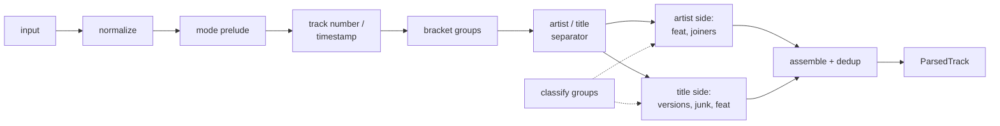

<div align="center">

# trackparse

**Turn messy track names into structured data: who made it, who's featured, who remixed it, and what's just noise.**

[](https://www.npmjs.com/package/trackparse)
[](https://pypi.org/project/trackparse/)
[](https://pypi.org/project/trackparse/)
[](https://github.com/4matic/trackparse/actions/workflows/js.yml)
[](https://github.com/4matic/trackparse/actions/workflows/python.yml)
[](https://github.com/4matic/trackparse/actions/workflows/spec.yml)
[](spec/fixtures)
[](js/package.json)
[](https://www.npmjs.com/package/trackparse)
[](js/src/types.ts)
[](LICENSE)

[Install](#install) · [Quick start](#quick-start) · [What it understands](#what-it-understands) · [How it's tested](#how-its-tested) · [API](#api) · [Spec](spec/SPEC.md)

</div>

```text
01. Wilkinson ft. Becky Hill & Tom Cane - Afterglow (Sub Focus VIP Remix) [Official Video]
└┬┘ └───┬───┘ └───────────┬───────────┘   └───┬───┘ └─────────┬─────────┘ └───────┬──────┘
 │      │                 │                   │               │                   │
 position 1               featured ×2         title           remix · Sub Focus · vip
        │                                                                         │
        primary                                                                   junk: video
```

Most title parsers give you `["Wilkinson ft. Becky Hill & Tom Cane", "Afterglow (Sub Focus VIP Remix)"]`
and call it a day. Or they "clean" the string and throw the feat and the remix away. Neither
tells you that Becky Hill is featured, that Sub Focus did the remix, or that it's a VIP.

trackparse keeps all of it. Its one rule is **extract, don't delete**: everything it recognises
goes into a field, and anything it doesn't recognise stays in the title, word for word.

```js
import { parse } from "trackparse";

const track = parse(
  "01. Wilkinson ft. Becky Hill & Tom Cane - Afterglow (Sub Focus VIP Remix) [Official Video]",
);

track.artists.map((a) => `${a.name} (${a.role})`);
// [ 'Wilkinson (primary)', 'Becky Hill (featured)', 'Tom Cane (featured)' ]
track.title;                        // 'Afterglow'
track.versions[0].type;             // 'remix'
track.versions[0].artists[0].name;  // 'Sub Focus'
track.versions[0].modifiers;        // [ 'vip' ]
track.junk;                         // [ { raw: 'Official Video', kind: 'video' } ]
track.position;                     // { raw: '01', number: 1 }
```

<details>
<summary>Full output</summary>

```json
{
  "input": "01. Wilkinson ft. Becky Hill & Tom Cane - Afterglow (Sub Focus VIP Remix) [Official Video]",
  "mode": "youtube",
  "position": { "raw": "01", "number": 1 },
  "timestamp": null,
  "artists": [
    { "name": "Wilkinson",  "role": "primary",  "joiner": null,  "source": "artist" },
    { "name": "Becky Hill", "role": "featured", "joiner": "ft.", "source": "artist" },
    { "name": "Tom Cane",   "role": "featured", "joiner": "&",   "source": "artist" }
  ],
  "title": "Afterglow",
  "fullTitle": "Afterglow (Sub Focus VIP Remix)",
  "versions": [
    {
      "type": "remix",
      "raw": "Sub Focus VIP Remix",
      "artists": [{ "name": "Sub Focus", "role": "remixer", "joiner": null, "source": "version" }],
      "modifiers": ["vip"],
      "descriptor": null,
      "year": null,
      "unknownArtist": false,
      "delimiter": "("
    }
  ],
  "year": null,
  "flags": { "explicit": false, "clean": false, "unknownArtist": false, "unknownTitle": false },
  "junk": [{ "raw": "Official Video", "kind": "video" }],
  "warnings": []
}
```

Every key is always present. When a guess was involved, `warnings` says which one.

</details>

## At a glance

| Number | What it means |
|---|---|
| **11,891** shared fixtures | 900 written by hand, 10,991 generated from combinations. 100% pass in JS and Python, nothing skipped. |
| **981** JS tests | every fixture, a schema check on every output, property-based tests of the spec invariants, API tests |
| **27** version types | remix, VIP, bootleg, extended, radio, original, live, remaster, sped up, … |
| **0** dependencies | ESM + CJS + TypeScript types, about 17 kB gzipped |
| **Node 18+** | CI runs the full suite on 22 and 24, and every fixture against the built package on 18 and 20 |
| **Python 3.9+** | 991 pytest tests on 3.9 to 3.14, plus every fixture against the built wheel. Output is byte-identical to JS |
| **1 spec** | [`spec/SPEC.md`](spec/SPEC.md) defines the behaviour; the Python port passes the same fixtures, and so will Rust |

## Install

```sh
npm install trackparse   # or: pnpm add / yarn add / bun add trackparse
```

Works in Node 18+ and any runtime with ES2020.

```sh
pip install trackparse   # or: uv add trackparse
```

Python 3.9+, no dependencies. A Rust port is [on the way](#ports).

## Quick start

```js
import { parse, parseArtists, format } from "trackparse";

parse("Noisia feat. Foreign Beggars - Shellshock").artists.map((a) => a.name);
// [ 'Noisia', 'Foreign Beggars' ]   (Foreign Beggars has role 'featured')

parse("Queen - Bohemian Rhapsody (Live at Wembley 1986)").versions[0];
// { type: 'live', year: 1986, descriptor: 'at Wembley', … }

parseArtists("Sub Focus, Wilkinson & Dimension feat. Kojo").map((a) => `${a.name}:${a.role}`);
// [ 'Sub Focus:primary', 'Wilkinson:primary', 'Dimension:primary', 'Kojo:featured' ]

format(parse("Wilkinson ft. Becky Hill - Afterglow (Sub Focus Remix)"), { feat: "title", joiners: "canonical" });
// 'Wilkinson - Afterglow (feat. Becky Hill) (Sub Focus Remix)'
```

CommonJS works too: `const { parse } = require("trackparse")`.

### Python

Same parser, same output. Functions are snake_case, results are frozen dataclasses, and
`to_dict()` gives the spec's JSON with camelCase keys, identical to what the JS package returns.

```python
from trackparse import format_track, parse, parse_artists

track = parse("Noisia feat. Foreign Beggars - Shellshock")
track.artists
# (Artist(name='Noisia', role='primary', joiner=None, source='artist'),
#  Artist(name='Foreign Beggars', role='featured', joiner='feat.', source='artist'))

parse("Queen - Bohemian Rhapsody (Live at Wembley 1986)").versions[0]
# Version(type='live', raw='Live at Wembley 1986', artists=(), modifiers=(),
#         descriptor='at Wembley', year=1986, unknown_artist=False, delimiter='(')

[f"{a.name}:{a.role}" for a in parse_artists("Sub Focus, Wilkinson & Dimension feat. Kojo")]
# ['Sub Focus:primary', 'Wilkinson:primary', 'Dimension:primary', 'Kojo:featured']

format_track(parse("Wilkinson ft. Becky Hill - Afterglow (Sub Focus Remix)"), feat="title", joiners="canonical")
# 'Wilkinson - Afterglow (feat. Becky Hill) (Sub Focus Remix)'

track.to_dict()["artists"][1]
# {'name': 'Foreign Beggars', 'role': 'featured', 'joiner': 'feat.', 'source': 'artist'}
```

Options are keyword arguments: `parse(s, mode="youtube", known_artists=["Chase & Status"])`. The
full Python API is in [`python/README.md`](python/README.md).

> [!TIP]
> `&` is a joiner, so `Chase & Status` comes out as two artists. There's no built-in artist
> database. Pass the names you know instead: `parse(s, { knownArtists: ["Chase & Status"] })` in
> JS, `parse(s, known_artists=["Chase & Status"])` in Python.

## What it understands

These are real outputs of `parse(input)` with default options, unless noted.

| Input | Artists | Title | Versions / other |
|---|---|---|---|
| `Noisia feat. Foreign Beggars - Shellshock` | Noisia, Foreign Beggars *(feat)* | `Shellshock` | |
| `Silk City - Electricity (with Dua Lipa)` | Silk City, Dua Lipa *(feat)* | `Electricity` | |
| `Skrillex & Diplo x Justin Bieber - Where Are Ü Now` | Skrillex, Diplo, Justin Bieber | `Where Are Ü Now` | |
| `Future - Mask Off (prod. by Metro Boomin)` | Future, Metro Boomin *(producer)* | `Mask Off` | |
| `Linkin Park - Numb (Remix by Skrillex)` | Linkin Park | `Numb` | remix by Skrillex |
| `Dimension - Offshore (Mefjus Remix / Noisia Remix)` | Dimension | `Offshore` | two remixes |
| `Pendulum - Watercolour (Extended VIP Mix)` | Pendulum | `Watercolour` | vip, +extended |
| `Noisia - Stigma (Phace Bootleg)` | Noisia | `Stigma` | bootleg by Phace |
| `Deadmau5 - Strobe (Radio Edit)` | Deadmau5 | `Strobe` | radio |
| `Netsky - Iron Heart (Levela Mix)` | Netsky | `Iron Heart` | remix by Levela |
| `The Beatles - Hey Jude - Remastered 2015` | The Beatles | `Hey Jude` | remaster, 2015 |
| `Taylor Swift - Love Story (Taylor's Version)` | Taylor Swift | `Love Story` | version, "Taylor's" |
| `Kordhell - Murder In My Mind (Slowed + Reverb)` | Kordhell | `Murder In My Mind` | slowed |
| `Eminem - Without Me (Explicit)` | Eminem | `Without Me` | explicit flag |
| `Daft Punk - One More Time (Official Music Video) [HD]` | Daft Punk | `One More Time` | junk: video, quality |
| `Elektronomia - Sky High [NCS Release]` | Elektronomia | `Sky High` | junk: label |
| `Porter Robinson - Shelter - YouTube` | Porter Robinson | `Shelter` | junk: platform |
| `01. Aphex Twin - Xtal` | Aphex Twin | `Xtal` | position 1 |
| `[12:34] Noisia - Stigma` | Noisia | `Stigma` | timestamp 754 s |
| `07_Burial_-_Archangel.mp3` | Burial | `Archangel` | filename mode, position 7 |
| `"Numb" by Linkin Park` *(youtube)* | Linkin Park | `Numb` | ⚠ bySplit |
| `Blink-182-All The Small Things` *(youtube)* | Blink-182 | `All The Small Things` | ⚠ unspacedDashSplit |
| `Кино - Группа крови (Remastered 2019)` | Кино | `Группа крови` | remaster, 2019 |
| `ID - ID (ID Remix)` | | `ID` | unknown artist, title and remixer |
| `AC/DC - Back In Black` | AC/DC | `Back In Black` | |
| `2 Unlimited - No Limit` | 2 Unlimited | `No Limit` | not a track number |
| `Mumford & Sons - Little Lion Man` | Mumford & Sons | `Little Lion Man` | not split |
| `The Rolling Stones - (I Can't Get No) Satisfaction` | The Rolling Stones | `(I Can't Get No) Satisfaction` | kept as is |

## How it's tested

The fixtures in [`spec/fixtures`](spec/fixtures) are the source of truth. The spec says what should
happen, the fixtures pin it down, and every port has to pass all of them. The JS and Python
packages both do: **11,891 of 11,891**, with empty skip lists, in CI on every push.

Passing a fixture only checks the fields the case asserts, so
[`scripts/compare-ports.mjs`](scripts/compare-ports.mjs) also runs every fixture input through both
ports and diffs the complete outputs. Result: 0 differences, byte for byte.

### Handwritten: 900 cases in 21 files

Each case cites the spec rules it exercises. 58 of them spell out the complete output field by
field, so nothing can drift unnoticed.

| Group | Cases | What's in there |
|---|---:|---|
| Regressions | 273 | Every test from two real-world parsers this library replaces, and the known failures of get-artist-title and friends |
| Versions and brackets | 90 | Every version keyword, generic heads (`Radio Edit` → radio), multi-version groups, feat inside brackets |
| Artists | 76 | Joiners, guards (`AC/DC`, `Mumford & Sons`, `Malcolm X`), `knownArtists`, dedup |
| Title credits and producers | 57 | `Title ft. X`, `(prod. by X)`, self-produced artists |
| Separators and suffixes | 63 | Dash variants, `- Remastered 2015`, unspaced and asymmetric dashes |
| Prefixes, junk, flags | 111 | Track numbers vs `2 Unlimited`, cue times, every junk kind, years, explicit/clean |
| Modes | 65 | YouTube pipes, `"Title" by Artist`, uploader fallback, filenames |
| Unicode and normalization | 71 | NFC, zero-width characters, fullwidth brackets, Cyrillic, CJK, Turkish İ |
| `format`, `parseArtists`, unknown IDs | 94 | Round-trips, canonical joiners, `ID - ID` |

### Generated: 10,991 cases

A deterministic generator in [`spec/generator`](spec/generator) builds inputs from small "atoms": an
artist, a joiner, a feat placement, a version group, a junk suffix. Each atom carries its own
expected contribution. The expected output is assembled from those atoms and never comes from
running a parser, so the generator can't just agree with the code it is testing.

| Scenario | Cases | | Scenario | Cases |
|---|---:|---|---|---:|
| artists × joiners | 1,811 | | kitchen sink (pairwise + random) | 1,589 |
| versions | 1,650 | | junk × YouTube | 806 |
| dash suffixes | 1,174 | | filenames | 780 |
| dedup | 1,008 | | unicode | 674 |
| feat placement | 922 | | prefixes | 577 |

### Properties

[fast-check](https://github.com/dubzzz/fast-check) throws thousands of random strings at the parser to
check the invariants from the spec ([Hypothesis](https://hypothesis.works) does the same for the
Python port):
- it never throws, on any input;
- a 10,000-character input stays linear;
- `normalize` is idempotent;
- whitespace, dash and zero-width noise don't change the result;
- every output validates against the schema;
- no word of the input goes missing;
- `parse(format(parse(s)))` round-trips.

```sh
pnpm install
pnpm test          # fixtures, properties, generator tests
pnpm conformance   # pass rate per fixture file and per spec rule

cd python && uv run pytest   # the same fixtures and invariants in Python
```

## API

### `parse(input, options?)` → `ParsedTrack`

| Field | Type | |
|---|---|---|
| `input` | `string` | The original string, untouched |
| `mode` | `"clean" \| "youtube" \| "filename"` | Resolved mode |
| `position` | `{ raw, number } \| null` | Track number (`"01"` → 1) |
| `timestamp` | `{ raw, seconds } \| null` | Leading cue time (`"1:02:03"` → 3723) |
| `artists` | `Artist[]` | Primary, featured and producer credits. Remixers live in `versions` |
| `title` | `string` | Clean title. Brackets it doesn't recognise stay in |
| `fullTitle` | `string` | `title` with versions re-attached |
| `versions` | `Version[]` | Remixes and versions, left to right |
| `year` | `number \| null` | From `(2015)` or `- 2015` |
| `flags` | `{ explicit, clean, unknownArtist, unknownTitle }` | |
| `junk` | `{ raw, kind }[]` | What was removed, and what kind of noise it was |
| `warnings` | `string[]` | Heuristics that fired |

<details>
<summary><code>Artist</code>, <code>Version</code>, junk kinds and warnings</summary>

**Artist:** `{ name, role, joiner, source }`

- `role` is `primary`, `featured`, `remixer` or `producer`. `&`, `x` and `vs.` are joiners, not roles.
- `joiner` is the text before the name as written (`"&"`, `","`, `"ft."`, `"prod. by"`), or `null`
  for the first name in a list.
- `source` is where the credit came from: `artist` (left of the dash), `title` (right of it) or
  `version`.

**Version:** `{ type, raw, artists, modifiers, descriptor, year, unknownArtist, delimiter }`

- `type`: `remix` `bootleg` `vip` `edit` `flip` `refix` `rework` `mashup` `blend` `dub` `mix`
  `extended` `radio` `club` `original` `instrumental` `acapella` `live` `acoustic` `remaster` `demo`
  `reprise` `cover` `version` `spedUp` `slowed` `nightcore`
- A generic word takes its type from the word in front of it: `Radio Edit` → radio,
  `Extended Mix` → extended. `<Name> Mix` is a remix by that name.
- `modifiers` holds words that didn't become the type (`Extended VIP Mix` → vip, `["extended"]`).
  `descriptor` holds leftover text (`"Taylor's"`, `"at Wembley"`, `"D'n'B"`).
- `delimiter` is `(`, `[`, `{`, or `-` for dash suffixes.

**Junk kinds:** `video`, `audio`, `lyrics`, `quality`, `promo`, `platform`, `label`, `genre`, `other`.
The vocabulary is in [`spec/data`](spec/data).

**Warnings:** `noSeparator`, `ambiguousSeparator`, `unspacedDashSplit`, `asymmetricDashSplit`,
`bySplit`, `quotedTitleSplit`, `ambiguousMixCredit`, `unbalancedBrackets`.

</details>

### Options

| Option | Default | |
|---|---|---|
| `mode` | `"auto"` | `"clean"`, `"youtube"`, `"filename"`, or detect from the string |
| `knownArtists` | `[]` | Names that are never split (`Chase & Status`, `Earth, Wind & Fire`) |
| `uploader` | – | YouTube channel, used as the artist when there's no separator (`- Topic` and `VEVO` are dropped) |
| `splitAnd` | `"auto"` | `and` splits only after a comma (`A, B and C`), so `Simon and Garfunkel` stays whole |
| `keywords` | – | Extra vocabulary: `versionHeads`, `descriptors`, `genres`, `junk`, `featMarkers` |

### Other functions

| Function | |
|---|---|
| `parseArtists(input, options?)` | Split a bare artist string into credits |
| `format(track, options?)` | Render back to a string. Options: `feat` (`source`/`artist`/`title`/`omit`), `featMarker`, `joiners` (`original`/`canonical`), `versions`, `producers`, `position` |
| `normalize(input)` | The Unicode cleanup every function runs first: NFC, invisible characters, dash, bracket and quote variants |
| `allArtists(track)` | Credits plus every remixer, deduplicated |
| `createParser(options)` | Compile options once for repeated calls; per-call options merge over them |
| `SPEC_VERSION` | The spec version this build implements |

```js
import { createParser } from "trackparse";

const parser = createParser({
  knownArtists: ["Chase & Status", "Camo & Krooked"],
  keywords: { versionHeads: { rerub: "rework" } },
});

parser.parse("Chase & Status x Camo & Krooked - Track (Alix Perez Rerub)").versions[0].type; // 'rework'
```

### Modes

| Mode | For | Adds |
|---|---|---|
| `clean` | Store metadata, tags | Only a spaced dash separates artist and title |
| `youtube` | Video titles, scrobbles | Pipe segments, `"Title" by Artist`, `Artist: "Title"`, unspaced dashes, trailing junk, uploader fallback |
| `filename` | Files | Strips the extension, `_` → space, `01-Track` numbering |
| `auto` | Anything | `filename` for known extensions, `youtube` when it sees junk, pipes or platform suffixes, `clean` otherwise |

## How it works

A fixed pipeline of hand-written scanners. There are no regexes with lookaround and no
backtracking, so it runs in linear time and ports to Python and Rust with the same output.



Brackets are swapped for placeholders before anything is split, so a `&` inside `(Chase & Status
Remix)` can't break the artist list. Groups are classified on their own: junk, feat, producer, flag,
year, version, or unknown. Unknown ones go back into the title untouched. The full rules, R0–R12,
are in [spec/SPEC.md](spec/SPEC.md).

## Ports

| Language | Package | Status |
|---|---|---|
| JavaScript / TypeScript | [`trackparse`](https://www.npmjs.com/package/trackparse) on npm | 0.2.0, reference implementation, 11,891 / 11,891 fixtures |
| Python | [`trackparse`](https://pypi.org/project/trackparse/) on PyPI | 0.2.0, 11,891 / 11,891 fixtures, output identical to JS |
| Rust | `trackparse` on crates.io | planned, same fixtures |

Want another language? The porting checklist is in [AGENTS.md](AGENTS.md).

## Compared to other libraries

| | trackparse | [get-artist-title](https://github.com/goto-bus-stop/get-artist-title) | [metadata-filter](https://github.com/web-scrobbler/metadata-filter) | [track_parser](https://rubygems.org/gems/track_parser) |
|---|---|---|---|---|
| Output | structured object | `[artist, title]` | cleaned strings | artists, feat, remixer |
| Artists as a list with roles | ✅ | – | – | `&` / `and` only |
| Remixers and version types | ✅ 27 types | – | removed | raw remix name |
| Noise | returned with a kind | removed | removed | – |
| Cross-language spec | ✅ | – | – | – |
| Last release | 2026 | 2021 | active | 2015 |

These libraries are fine at what they set out to do. If all you need is a clean string to scrobble,
metadata-filter is great. get-artist-title's YouTube test cases helped shape several rules here.
trackparse is for when you need to know who did what.

## Limitations

trackparse parses one track string at a time. Not there yet:

- Multi-line tracklists and DJ cue sheets.
- Label and catalogue numbers (`[HOSP123]`) as fields. Label-like groups currently land in `junk`.
- Key and BPM (`8A`, `174 BPM`).
- An artist database. `Earth, Wind & Fire` splits unless it's in `knownArtists`.

Planned next: the Rust port, then a browser playground, then tracklists.

## Contributing

Behaviour changes start in the spec: a rule in [SPEC.md](spec/SPEC.md), a fixture that pins it,
then the code. [AGENTS.md](AGENTS.md) has the repo map, the workflow and every command. The most
useful bug report is an input string plus the output you expected. It usually becomes a fixture
as is.

## License

[MIT](LICENSE) © Maksim Maksimov. Some regression inputs come from the test suite of
[get-artist-title](https://github.com/goto-bus-stop/get-artist-title) (MIT, © 2016 René Kooi); see
[THIRD_PARTY_NOTICES.md](THIRD_PARTY_NOTICES.md).
